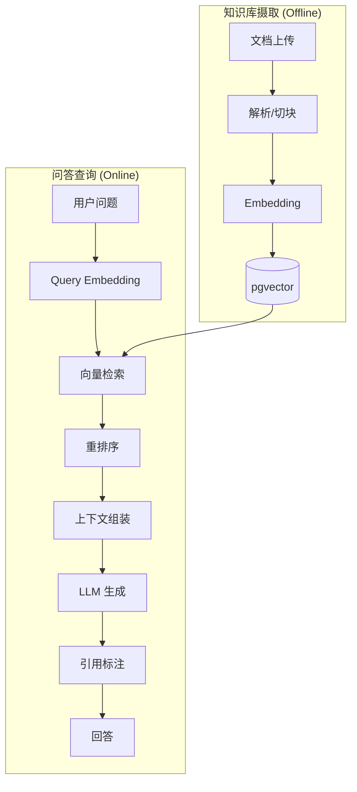
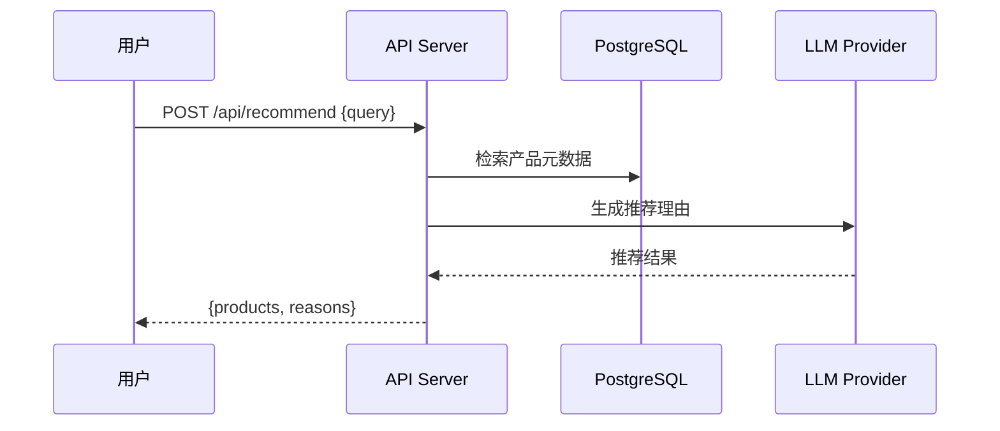
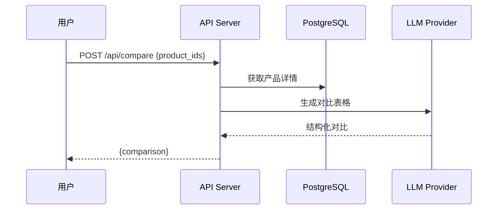
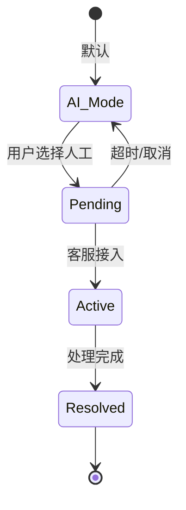

# Core Flows Architecture

> 核心业务流程设计，包括 RAG Pipeline、推荐流程、人机转接流程。

## — BEGIN REGISTRY —

```architecture-registry
schema_version: "v0.6.3"
type: "flows"
parent: "docs/L2/api-server/requirements.md"

items:
  - id: ARCH-FL-001
    statement: "{流程设计决策}"
    sources:
      - id: "{REQ-ID}"
        path: "{文件路径#ID}"
    rationale: "{决策理由}"
```

## — END REGISTRY —

---

## 1. RAG Pipeline

### 1.1 整体流程



### 1.2 知识库摄取 (Ingestion)

| 阶段 | 说明 | 技术选型 | REQ 来源 |
|------|------|----------|----------|
| 解析 | PDF/Word/TXT 提取文本 | unstructured / python-docx | REQ-L2-API-009 |
| 切块 | 按语义分块 | {{chunking.strategy}} (见 architecture-defaults.yaml) | |
| Embedding | 文本向量化 | {{embedding.model}} | REQ-L2-API-004 |
| 存储 | 向量 + 元数据 | pgvector | |

**切块策略** (见 `architecture-defaults.yaml`):

```python
chunk_size = {{chunking.size}}      # 字符数
chunk_overlap = {{chunking.overlap}}    # 重叠
separators = {{chunking.separators}}
```

### 1.3 在线查询 (Query)

| 阶段 | 说明 | 配置 | REQ 来源 |
|------|------|------|----------|
| Query Embedding | 问题向量化 | 同 Ingestion | REQ-L2-API-001 |
| 检索 | Top-K 召回 | K={{retrieval.top_k}} | |
| 重排序 | 相关性排序 | {{retrieval.reranker}} | REQ-L0-RISK-002 |
| 上下文 | 组装 Prompt | Max {{llm.max_context_tokens}} tokens | |
| LLM 生成 | 回答生成 | GPT-4 / DeepSeek | REQ-L2-API-004 |
| 引用标注 | 来源标记 | [1], [2]... | REQ-L2-API-001 |

### 1.4 降级策略

| 场景 | 降级措施 | REQ 来源 |
|------|----------|----------|
| LLM 不可用 | 返回"服务暂时不可用" | REQ-L0-STAB-002 |
| 检索无结果 | 返回"暂无相关信息" | REQ-L2-API-001 |
| 超时 | 返回缓存回答 (如有) | REQ-L0-PERF-001 |

---

## 2. 产品推荐流程



### 推荐策略

| 策略 | 说明 | REQ 来源 |
|------|------|----------|
| 向量相似度 | 需求与产品描述匹配 | REQ-L2-API-005 |
| 规格匹配 | 规格参数筛选 | |
| LLM 排序 | 综合推荐理由 | |

---

## 3. 产品比较流程



### 对比字段

| 字段 | 来源 | 说明 |
|------|------|------|
| 基本信息 | products.name/category | 固定 |
| 规格参数 | products.specs | 动态提取 |
| 价格 | products.price | 可选 |
| 优缺点 | LLM 生成 | 智能分析 |

---

## 4. 人机转接流程



### 状态说明

| 状态 | 说明 | REQ 来源 |
|------|------|----------|
| AI_Mode | AI 对话模式 | REQ-L2-API-010 |
| Pending | 等待人工接入 | |
| Active | 人工对话中 | |
| Resolved | 已处理 | |

---

## 5. 缓存策略

| 场景 | 缓存层 | TTL | REQ 来源 |
|------|--------|-----|----------|
| 产品列表 | Redis | 10 min | REQ-L0-PERF-001 |
| 热门问答 | Redis | 1 hour | REQ-L0-RISK-001 |
| Session | Redis | 30 min | REQ-L2-API-003 |

---

## 6. Token 用量统计

```python
# 记录每次调用
usage = {
    "session_id": session.id,
    "prompt_tokens": response.usage.prompt_tokens,
    "completion_tokens": response.usage.completion_tokens,
    "model": config.LLM_MODEL,
    "timestamp": datetime.now()
}
```

| 指标 | 计算 | REQ 来源 |
|------|------|----------|
| 日用量 | SUM(prompt + completion) | REQ-L0-RISK-001 |
| 成本估算 | tokens * price_per_1k | REQ-L0-CON-001 |
