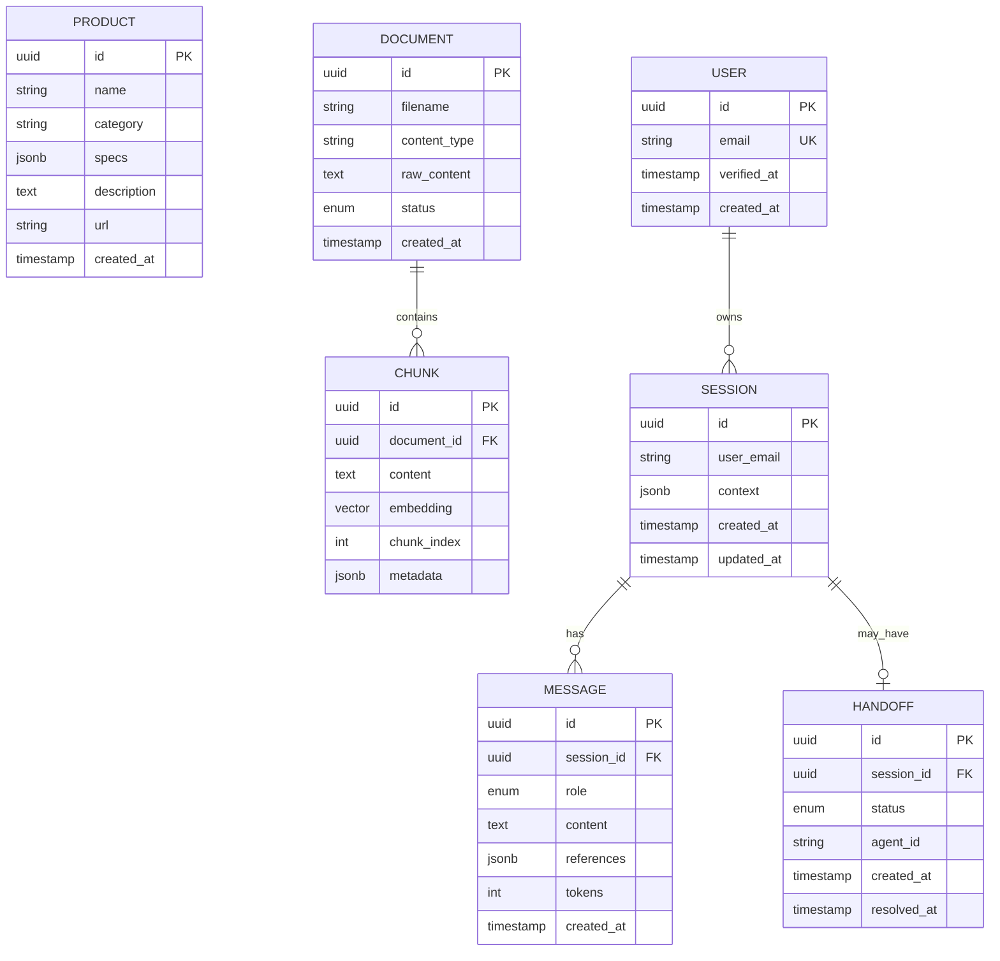

# Database Schema Design

> 数据库架构设计，包含逻辑模型、物理模型、索引策略和迁移管理。

## — BEGIN REGISTRY —

```architecture-registry
schema_version: "v0.6.3"
type: "database"
parent: "docs/L2/api-server/requirements.md"

items:
  - id: ARCH-DB-001
    statement: "{数据库设计决策}"
    sources:
      - id: "{REQ-ID}"
        path: "{文件路径#ID}"
    rationale: "{决策理由}"
```

## — END REGISTRY —

---

## 1. 实体关系概览 (ER Overview)



---

## 2. 表定义 (Table Definitions)

### 2.1 products

| 列名 | 类型 | 约束 | 说明 | REQ 来源 |
|------|------|------|------|----------|
| id | UUID | PK, DEFAULT uuid_generate_v4() | 主键 | REQ-L2-API-008 |
| name | VARCHAR(255) | NOT NULL | 产品名称 | |
| category | VARCHAR(100) | NOT NULL, INDEX | 产品类别 | |
| specs | JSONB | DEFAULT '{}' | 规格参数 | |
| short_description | TEXT | | 简短描述 | |
| price | DECIMAL(10,2) | | 价格 | |
| url | TEXT | NOT NULL | 详情页链接 | |
| created_at | TIMESTAMPTZ | DEFAULT NOW() | 创建时间 | |
| updated_at | TIMESTAMPTZ | | 更新时间 | |

### 2.2 documents

| 列名 | 类型 | 约束 | 说明 | REQ 来源 |
|------|------|------|------|----------|
| id | UUID | PK | 主键 | REQ-L2-API-009 |
| filename | VARCHAR(255) | NOT NULL | 文件名 | |
| content_type | VARCHAR(50) | | MIME 类型 | |
| raw_content | TEXT | | 原始内容 | |
| status | ENUM | DEFAULT 'pending' | pending/indexed/error | |
| metadata | JSONB | | 元数据 | |
| created_at | TIMESTAMPTZ | DEFAULT NOW() | | |

### 2.3 chunks

| 列名 | 类型 | 约束 | 说明 | REQ 来源 |
|------|------|------|------|----------|
| id | UUID | PK | 主键 | REQ-L2-API-001 |
| document_id | UUID | FK → documents.id | 所属文档 | |
| content | TEXT | NOT NULL | 分块内容 | |
| embedding | VECTOR(1536) | NOT NULL | 向量嵌入 | |
| chunk_index | INT | NOT NULL | 块序号 | |
| metadata | JSONB | | 包含原文位置等 | |

### 2.4 sessions

| 列名 | 类型 | 约束 | 说明 | REQ 来源 |
|------|------|------|------|----------|
| id | UUID | PK | 会话 ID | REQ-L2-API-003 |
| user_email | VARCHAR(255) | INDEX | 用户邮箱 | |
| context | JSONB | | productId/skuId/url | REQ-L2-API-002 |
| created_at | TIMESTAMPTZ | | | |
| updated_at | TIMESTAMPTZ | | | |

### 2.5 messages

| 列名 | 类型 | 约束 | 说明 | REQ 来源 |
|------|------|------|------|----------|
| id | UUID | PK | 消息 ID | REQ-L2-API-003 |
| session_id | UUID | FK, INDEX | 所属会话 | |
| role | ENUM | user/assistant/system | 角色 | |
| content | TEXT | NOT NULL | 消息内容 | |
| references | JSONB | | 引用来源 | REQ-L2-API-001 |
| tokens | INT | | Token 用量 | |
| created_at | TIMESTAMPTZ | | | |

### 2.6 users

| 列名 | 类型 | 约束 | 说明 | REQ 来源 |
|------|------|------|------|----------|
| id | UUID | PK | 用户 ID | REQ-L2-API-007 |
| email | VARCHAR(255) | UNIQUE, NOT NULL | 邮箱 | |
| verified_at | TIMESTAMPTZ | | 验证时间 | |
| created_at | TIMESTAMPTZ | | | |

### 2.7 handoffs

| 列名 | 类型 | 约束 | 说明 | REQ 来源 |
|------|------|------|------|----------|
| id | UUID | PK | 转接 ID | REQ-L2-API-010 |
| session_id | UUID | FK | 会话 | |
| status | ENUM | pending/active/resolved | 状态 | |
| agent_id | VARCHAR(100) | | 客服标识 | |
| created_at | TIMESTAMPTZ | | | |
| resolved_at | TIMESTAMPTZ | | | |

---

## 3. 索引策略 (Index Strategy)

### 3.1 向量索引 (pgvector)

```sql
-- HNSW 索引，适合高召回率场景
CREATE INDEX idx_chunks_embedding 
ON chunks 
USING hnsw (embedding vector_cosine_ops)
WITH (m = 16, ef_construction = 64);
```

| 参数 | 值 | 说明 |
|------|-----|------|
| 索引类型 | HNSW | 比 IVFFlat 更适合动态数据 |
| 维度 | 1536 | text-embedding-ada-002 |
| 距离函数 | cosine | 语义相似度 |

### 3.2 普通索引

```sql
-- 产品搜索
CREATE INDEX idx_products_category ON products(category);
CREATE INDEX idx_products_name_gin ON products USING gin(to_tsvector('simple', name));

-- 会话查询
CREATE INDEX idx_sessions_user ON sessions(user_email);
CREATE INDEX idx_messages_session ON messages(session_id);

-- 转接队列
CREATE INDEX idx_handoffs_status ON handoffs(status) WHERE status = 'pending';
```

---

## 4. 迁移策略 (Migration)

### 4.1 工具选择

| 工具 | 说明 |
|------|------|
| Alembic | Python/SQLAlchemy 迁移 |
| 命名规范 | `YYYYMMDD_HHMMSS_description.py` |

### 4.2 版本管理

```
alembic/versions/
├── 20260116_001_init_schema.py
├── 20260116_002_add_pgvector.py
└── 20260117_001_add_handoffs.py
```

---

## 5. 性能预估

| 表 | 预估行数 | 存储 | 说明 |
|-----|----------|------|------|
| products | ~600 | 10 MB | 固定 SKU |
| documents | ~100 | 50 MB | 知识库文档 |
| chunks | ~10,000 | 200 MB | 含向量 |
| sessions | ~10,000/月 | 100 MB | 归档策略 TBD |
| messages | ~50,000/月 | 200 MB | 保留期 TBD |
