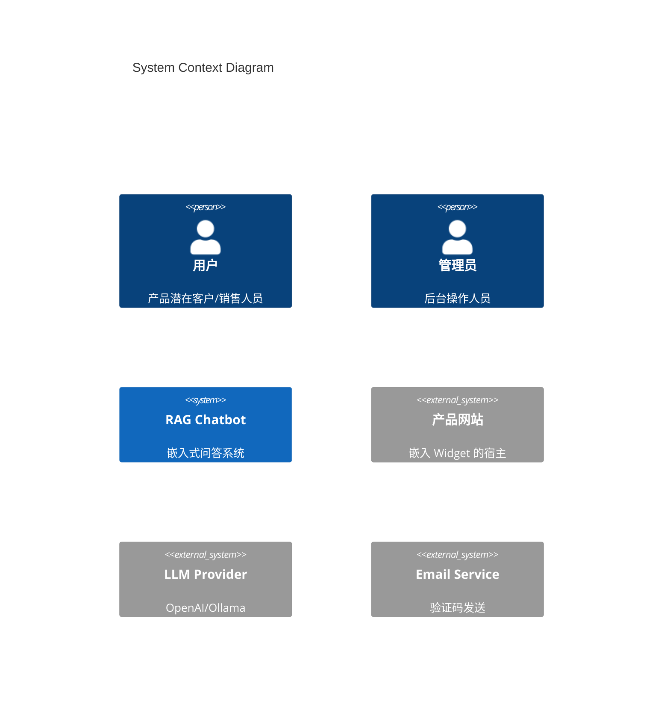
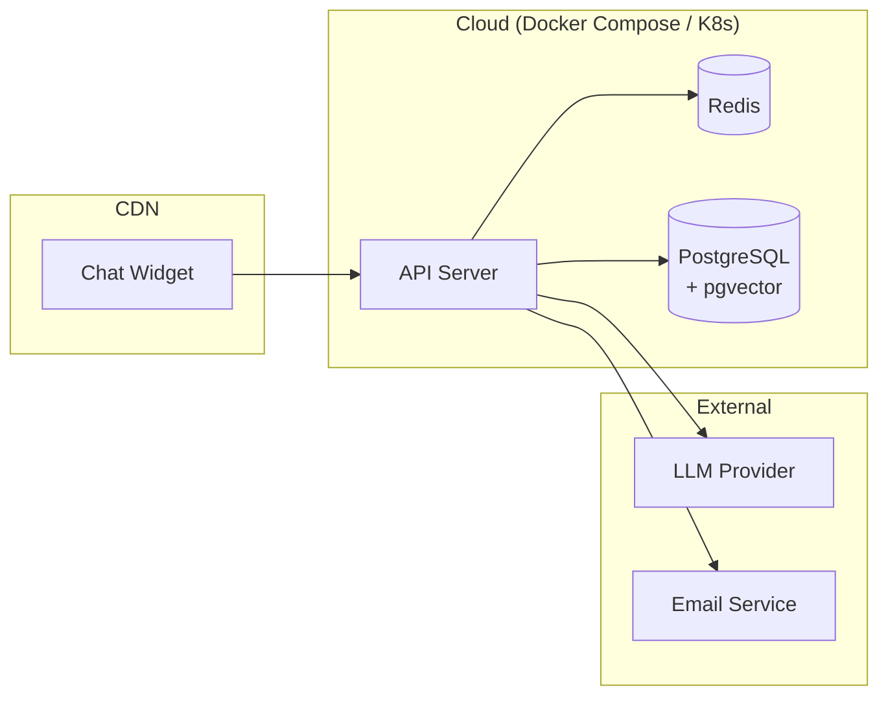

# System Architecture Overview

> 系统架构概览文档，定义组件边界、部署拓扑和安全信任边界。

## — BEGIN REGISTRY —

```architecture-registry
schema_version: "v0.6.3"
type: "overview"
parent: "docs/L2/interfaces.md"

items:
  # ===========================================================================
  # 系统架构决策
  # ===========================================================================
  - id: ARCH-OV-001
    statement: "{架构决策描述}"
    sources:
      - id: "{REQ-ID 或 IFC-ID}"
        path: "{文件路径#ID}"
    rationale: "{决策理由}"
    
  # ... 更多决策
```

## — END REGISTRY —

---

## 1. 系统上下文 (System Context)



### 说明

| 角色 | 描述 |
|------|------|
| 用户 | 通过 Widget 与系统交互 |
| 管理员 | 通过后台管理数据和客服 |

---

## 2. 组件边界 (Component Boundaries)

```
┌─────────────────────────────────────────────────────────────────┐
│                        产品网站 (Host)                           │
│  ┌───────────────────┐                                          │
│  │   Chat Widget     │ ←─ 嵌入式组件                             │
│  │   (TypeScript)    │                                          │
│  └─────────┬─────────┘                                          │
└────────────┼────────────────────────────────────────────────────┘
             │ HTTPS
     ┌───────▼───────┐
     │   API Server  │ ←─ 后端核心服务
     │   (FastAPI)   │
     └───────┬───────┘
             │
     ┌───────▼───────┐     ┌─────────────────┐
     │  PostgreSQL   │     │  Admin Dashboard│
     │  + pgvector   │     │   (TypeScript)  │
     └───────────────┘     └─────────────────┘
```

### 组件职责

| 组件 | 技术栈 | 职责 | REQ 来源 |
|------|--------|------|----------|
| api-server | Python/FastAPI | RAG/推荐/比较/管理 API | REQ-L2-API-* |
| chat-widget | TypeScript/React | 前端交互组件 | REQ-L2-WGT-* |
| admin-dashboard | TypeScript/React | 后台管理 UI | REQ-L2-ADM-* |

---

## 3. 部署拓扑 (Deployment Topology)



### 环境配置

| 环境 | 说明 |
|------|------|
| dev | 本地开发，Ollama |
| staging | 云端预发布 |
| prod | 生产环境 |

---

## 4. 信任边界 (Trust Boundaries)

```
┌──────────────────────────────────────────────────────────────┐
│ 公开区域 (Public Zone)                                        │
│  - Chat Widget (用户浏览器)                                   │
│  - 产品网站                                                    │
└──────────────────────────────────────────────────────────────┘
        │
        ▼ HTTPS + Rate Limit
┌──────────────────────────────────────────────────────────────┐
│ API 边界 (API Boundary)                                       │
│  - API Server 公开端点                                        │
│  - 认证: 邮箱验证码 / API Key                                 │
│  - 输入校验 + Prompt Injection 防护                          │
└──────────────────────────────────────────────────────────────┘
        │
        ▼ Internal Network
┌──────────────────────────────────────────────────────────────┐
│ 内部区域 (Internal Zone)                                      │
│  - PostgreSQL                                                 │
│  - Redis                                                      │
│  - Admin Dashboard (需认证)                                  │
└──────────────────────────────────────────────────────────────┘
```

### 安全措施

| 边界 | 措施 | REQ 来源 |
|------|------|----------|
| Public → API | HTTPS, Rate Limit | REQ-L0-SEC-001, SEC-003 |
| API → DB | 最小权限, 参数化查询 | REQ-L0-SEC-002 |
| User Input | Prompt Injection 防护 | REQ-L0-SEC-004 |

---

## 5. 技术栈约束

| 类别 | 技术 | 来源 |
|------|------|------|
| 后端 | Python, FastAPI | charter.yaml#constraints |
| 前端 | TypeScript, React | charter.yaml#constraints |
| 数据库 | PostgreSQL + pgvector | charter.yaml#constraints |
| 缓存 | Redis | charter.yaml#constraints |
| LLM | OpenAI API / Ollama | charter.yaml#constraints |
