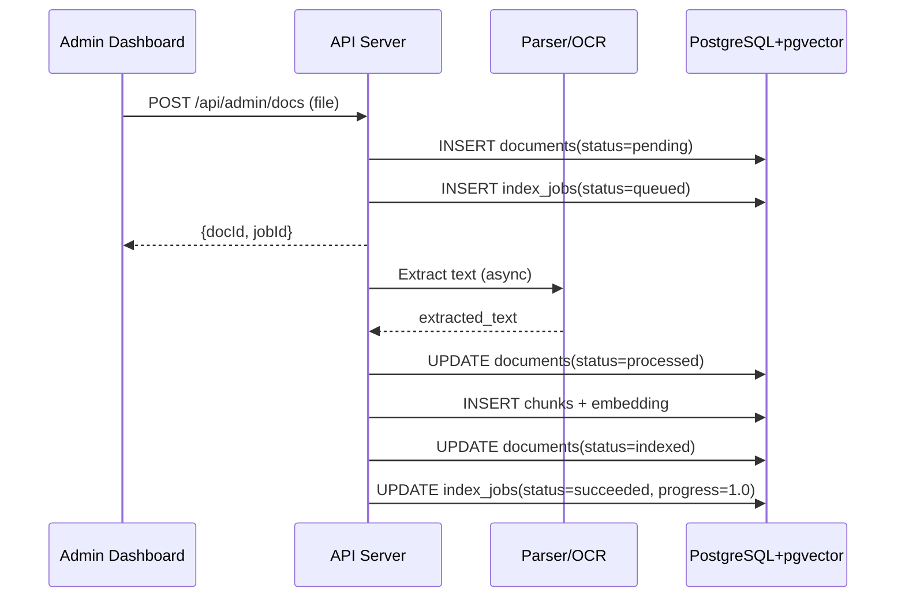
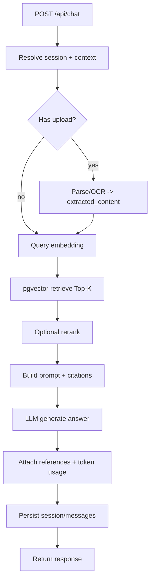
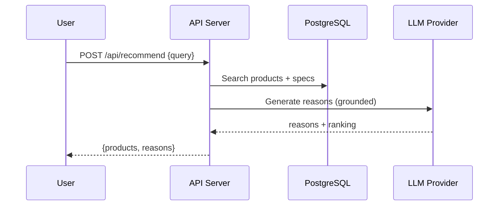
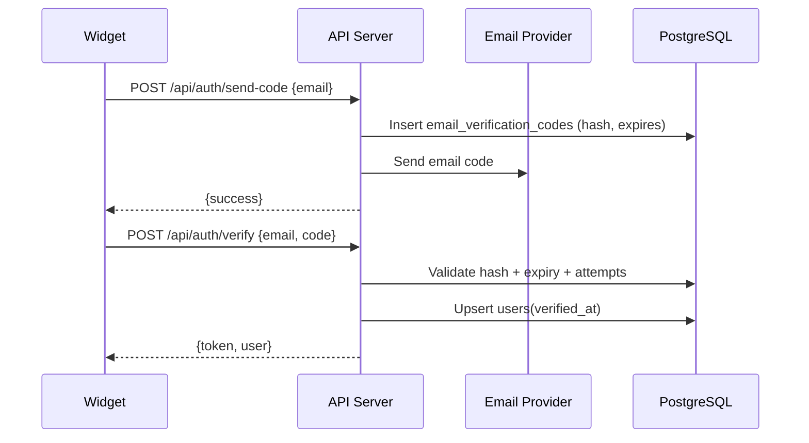
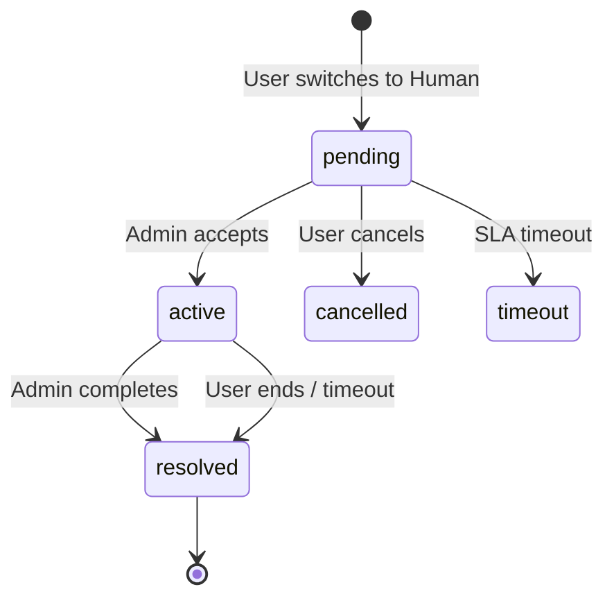

# Core Flows Architecture

> 核心流程设计：RAG Pipeline、推荐/对比、人机转接、语音与上传。

## — BEGIN REGISTRY —

```architecture-registry
schema_version: "v0.6.5"
type: "flows"
parent: "docs/L2/api-server/requirements.md"

items:
  - id: ARCH-FL-001
    statement: "知识库摄取采用“上传 → 解析 → 切块 → 向量化 → 入库”流水线，并记录可查询的任务状态与失败原因。"
    sources:
      - id: "REQ-L2-API-009"
        path: "docs/L2/api-server/requirements.md#REQ-L2-API-009"
      - id: "REQ-L2-ADM-002"
        path: "docs/L2/admin-dashboard/requirements.md#REQ-L2-ADM-002"
    rationale: "将索引构建产品化，便于后台观测与运维，避免构建过程不可见。"

  - id: ARCH-FL-002
    statement: "在线问答采用“Query Embedding → pgvector Top-K 召回 →（可选）重排 → Prompt 组装 → LLM 生成 → 引用回填”的标准 RAG 流程。"
    sources:
      - id: "REQ-L2-API-001"
        path: "docs/L2/api-server/requirements.md#REQ-L2-API-001"
    rationale: "在保证引用可追溯的前提下提升回答相关性，并满足无依据时澄清/拒答要求。"

  - id: ARCH-FL-003
    statement: "上下文感知检索将 productId/skuId/url 作为过滤/加权信号参与召回与排序，优先返回与当前页面相关的证据。"
    sources:
      - id: "REQ-L2-API-002"
        path: "docs/L2/api-server/requirements.md#REQ-L2-API-002"
      - id: "IFC-WIDGET-CTX"
        path: "docs/L2/interfaces.md#IFC-WIDGET-CTX"
    rationale: "降低“泛检索”带来的幻觉风险，提高用户当前场景下的命中率。"

  - id: ARCH-FL-004
    statement: "对话历史采用追加写并在每次回答后记录 token_usage/references/error，支持多轮上下文与后续成本分析。"
    sources:
      - id: "REQ-L2-API-003"
        path: "docs/L2/api-server/requirements.md#REQ-L2-API-003"
    rationale: "为质量评估与成本治理提供可用数据，同时保证多轮对话体验。"

  - id: ARCH-FL-005
    statement: "人工转接采用状态机：Widget 发起转接后进入队列，客服工作台接入后置为 active，完成后置为 resolved 并可回退 AI。"
    sources:
      - id: "REQ-L2-API-010"
        path: "docs/L2/api-server/requirements.md#REQ-L2-API-010"
      - id: "REQ-L2-WGT-006"
        path: "docs/L2/chat-widget/requirements.md#REQ-L2-WGT-006"
      - id: "REQ-L2-ADM-004"
        path: "docs/L2/admin-dashboard/requirements.md#REQ-L2-ADM-004"
    rationale: "确保前后端对“排队/接入/完成”的语义一致，并支持降级与超时处理。"

  - id: ARCH-FL-006
    statement: "文件/图片上传作为对话输入时先解析为 extracted_content 注入本轮上下文，并在必要时沉淀为可索引文档。"
    sources:
      - id: "REQ-L2-API-012"
        path: "docs/L2/api-server/requirements.md#REQ-L2-API-012"
      - id: "REQ-L2-WGT-005"
        path: "docs/L2/chat-widget/requirements.md#REQ-L2-WGT-005"
    rationale: "满足“上传即用”的交互，同时避免所有上传都强制进入长期知识库带来的合规与成本风险。"
```

## — END REGISTRY —

---

## 1. 知识库摄取（Ingestion / Offline）



关键点：
- `documents` 保存文档元数据与 extracted_text（最小化保留原始文件）。
- `chunks` 保存分块文本与 embedding，用于召回与引用。
- `index_jobs` 作为后台“索引状态”查询的来源，可记录失败原因。

---

## 2. RAG 问答（Online）



### 2.1 上下文感知检索

来自 Widget 的 `context`（`productId/skuId/url`）参与检索：
- 过滤：优先召回与 `productId/skuId` 关联的产品字段与文档 chunks（如 metadata 中标记的 product_id）。
- 加权：对“同类目产品”或“同页面来源”的 chunks 提权。

### 2.2 无依据时澄清/拒答

当召回证据不足（如 Top-K 相似度低于阈值或引用为空）：
- 优先澄清：向用户询问缺失信息（型号、类目、材料、厚度等）。
- 或拒答：明确说明“暂无可靠资料支撑”，并提示上传文档/转人工。

---

## 3. 产品推荐 / 产品比较



推荐/对比建议共用的“证据来源”：
- `products` 结构化字段（类目/规格/价格/链接）。
- `documents/chunks` 中召回的说明书/FAQ chunks（可选，按需要启用）。

---

## 4. 邮箱验证码登录（Auth）



---

## 5. 人机转接（Handoff）



约定：
- Widget 侧展示 `pending` 队列信息（位置/预计等待）。
- Admin 工作台展示队列并对 `accept/complete` 做操作审计。
- 超时/不可用时，Widget 允许回退到 AI 并提示原因（降级体验在 TBD 中细化）。

---

## 6. 语音（STT/TTS）与上传（Upload）

语音：
- `POST /api/voice/stt`：音频 → 文本，作为 `/api/chat.message` 输入。
- `POST /api/voice/tts`：文本 → 音频 URL/bytes，用于播放回复。

上传：
- Widget 上传文件/图片 → `/api/upload` 返回 `extracted_content`（以及可选 `documentId`）。
- 后端将 `extracted_content` 注入本轮 prompt，并按策略决定是否进入长期知识库（`documents.source=chat`）。
