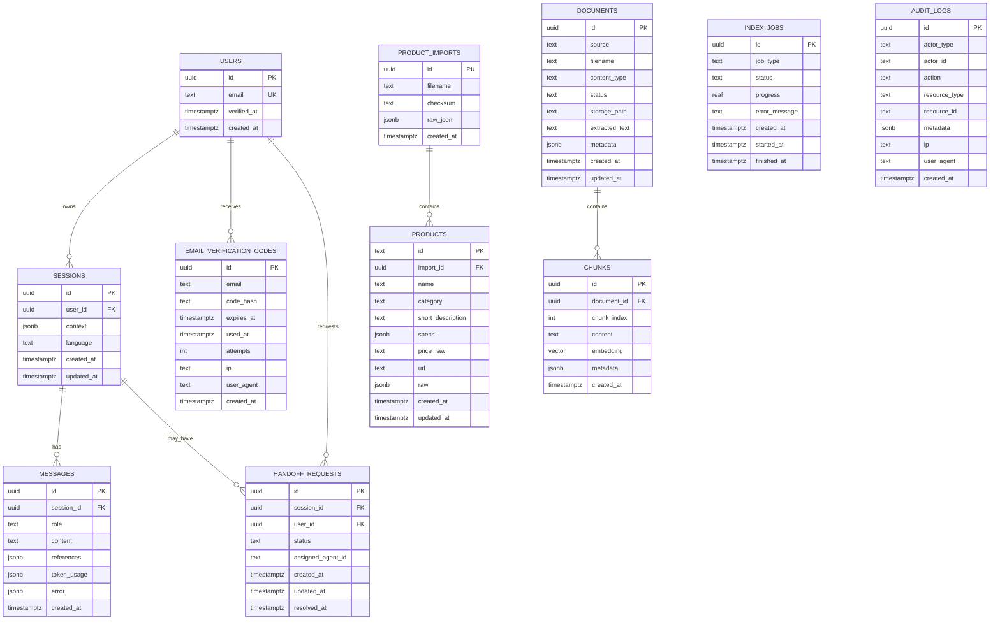

# Database Schema Design

> 数据库架构设计：实体模型、索引策略、迁移与留存策略。

## — BEGIN REGISTRY —

```architecture-registry
schema_version: "v0.6.5"
type: "database"
parent: "docs/L2/api-server/requirements.md"

items:
  - id: ARCH-DB-001
    statement: "使用 PostgreSQL 作为统一主存储，并启用 pgvector 承载向量检索与业务数据。"
    sources:
      - id: "REQ-L2-API-009"
        path: "docs/L2/api-server/requirements.md#REQ-L2-API-009"
    rationale: "与技术边界一致（v0.1 统一使用 pgvector），同时可用事务保证一致性。"

  - id: ARCH-DB-002
    statement: "产品数据采用“结构化字段 + 原始 JSON”双写策略，并记录每次导入版本以支持回滚与审计。"
    sources:
      - id: "REQ-L2-API-008"
        path: "docs/L2/api-server/requirements.md#REQ-L2-API-008"
      - id: "IFC-PRODUCT-DATA"
        path: "docs/L2/interfaces.md#IFC-PRODUCT-DATA"
    rationale: "适配外部 JSON 数据契约并允许字段扩展，同时为版本管理保留空间。"

  - id: ARCH-DB-003
    statement: "知识库采用 documents + chunks 分层模型；chunks.embedding 使用 pgvector 向量列并建立 HNSW 索引。"
    sources:
      - id: "REQ-L2-API-009"
        path: "docs/L2/api-server/requirements.md#REQ-L2-API-009"
      - id: "REQ-L0-PERF-002"
        path: "docs/L0/requirements.md#REQ-L0-PERF-002"
    rationale: "以分块提升召回与可追溯性，并通过向量索引满足检索延迟目标。"

  - id: ARCH-DB-004
    statement: "对话历史采用 sessions + messages 追加写模型，messages 记录 references 与 token_usage，支持后续成本/质量分析。"
    sources:
      - id: "REQ-L2-API-003"
        path: "docs/L2/api-server/requirements.md#REQ-L2-API-003"
    rationale: "支持多轮对话与可观测性需求，便于离线评估与审计。"

  - id: ARCH-DB-005
    statement: "邮箱验证码登录采用 users + email_verification_codes 存储，验证码仅存 hash 并配置过期与尝试次数。"
    sources:
      - id: "REQ-L2-API-007"
        path: "docs/L2/api-server/requirements.md#REQ-L2-API-007"
    rationale: "降低敏感数据泄露风险并支持频控与滥用防护。"

  - id: ARCH-DB-006
    statement: "人工转接采用 handoff_requests 状态机表，记录队列与处理结果，并关联 session 以便客服工作台接入。"
    sources:
      - id: "REQ-L2-API-010"
        path: "docs/L2/api-server/requirements.md#REQ-L2-API-010"
      - id: "REQ-L2-ADM-004"
        path: "docs/L2/admin-dashboard/requirements.md#REQ-L2-ADM-004"
    rationale: "将“排队/接入/完成”作为可追踪的后端状态，确保前后端一致。"

  - id: ARCH-DB-007
    statement: "后台与关键写操作记录 audit_logs（操作审计），用于安全合规、问题追踪与后台日志展示。"
    sources:
      - id: "REQ-L0-SEC-003"
        path: "docs/L0/requirements.md#REQ-L0-SEC-003"
      - id: "REQ-L2-ADM-002"
        path: "docs/L2/admin-dashboard/requirements.md#REQ-L2-ADM-002"
    rationale: "满足“后台操作审计日志”与可观测性需求，支撑运营与排障。"

  - id: ARCH-DB-008
    statement: "索引构建与重建采用 index_jobs 记录任务状态与进度，支持后台查询与失败诊断。"
    sources:
      - id: "REQ-L2-API-009"
        path: "docs/L2/api-server/requirements.md#REQ-L2-API-009"
    rationale: "将索引构建过程产品化（可观测/可重试），避免“黑盒重建”。"
```

## — END REGISTRY —

---

## 1. 实体关系概览 (ER Overview)



> 注：`vector` 列建议使用固定维度（如 `vector(1536)`）；如切换 Embedding 模型需通过迁移调整维度。

---

## 2. 表设计（核心字段）

### 2.1 product_imports / products（产品数据）

- `product_imports`：记录每次产品 JSON 上传（文件名、checksum、原始 JSON）。
- `products`：为检索/展示提供结构化字段，同时保留 `raw/specs` 以兼容扩展字段。

### 2.2 documents / chunks（知识库与向量）

- `documents.source`：`admin`（后台上传）/ `chat`（用户上传作为对话输入）。
- `documents.status`：`pending` → `processed` → `indexed` / `error`。
- `chunks.embedding`：`vector(1536)`（默认），使用 cosine 距离并建立向量索引。

### 2.3 sessions / messages（会话与消息）

- `sessions.context`：来自 `IFC-WIDGET-CTX` 的 `productId/skuId/url` 等。
- `messages.references`：结构化引用（文档 chunk / 产品字段等）。
- `messages.token_usage`：`{prompt, completion, model}`。

### 2.4 users / email_verification_codes（邮箱登录）

- `email_verification_codes.code_hash`：验证码 hash（不落明文）。
- 结合 `expires_at/attempts/ip` 做频控与滥用防护。

### 2.5 handoff_requests（人工转接）

- 状态建议：`pending | active | resolved | cancelled | timeout`。
- 通过 `session_id` 关联对话内容，客服工作台“接入/完成”均写入状态变更并记录审计日志。

### 2.6 index_jobs（索引构建）

- 用于 `/api/admin/index/rebuild` 与 `/api/admin/index/status` 的后台状态来源。
- 可扩展按文档粒度的 job 或将 job_id 写回 documents.metadata。

### 2.7 audit_logs（操作审计）

- 建议所有后台写接口与关键系统事件写入 audit_logs。

---

## 3. 索引策略 (Index Strategy)

### 3.1 向量索引（pgvector / HNSW）

```sql
-- 例：cosine 距离 + HNSW（参数按数据量调优）
CREATE INDEX IF NOT EXISTS idx_chunks_embedding_hnsw
ON chunks
USING hnsw (embedding vector_cosine_ops)
WITH (m = 16, ef_construction = 64);
```

### 3.2 业务索引（示例）

```sql
-- 产品检索
CREATE INDEX IF NOT EXISTS idx_products_category ON products(category);
CREATE INDEX IF NOT EXISTS idx_products_name_trgm ON products USING gin (name gin_trgm_ops);

-- 会话与消息
CREATE INDEX IF NOT EXISTS idx_messages_session_id ON messages(session_id);

-- 转接队列
CREATE INDEX IF NOT EXISTS idx_handoff_pending ON handoff_requests(status) WHERE status = 'pending';

-- 审计日志
CREATE INDEX IF NOT EXISTS idx_audit_created_at ON audit_logs(created_at);
```

---

## 4. 迁移策略 (Migration)

- 推荐：Alembic（SQLAlchemy）。
- 命名：`YYYYMMDD_HHMMSS_<description>.py`。
- pgvector 启用：在 init migration 中执行 `CREATE EXTENSION IF NOT EXISTS vector;`。

---

## 5. 留存与合规（默认建议）

- 会话/消息：按 `charter.yaml#open_questions[TBD-004]` 明确留存期前，默认建议可配置（如 30/90 天）并支持脱敏导出。
- 上传文件：仅存必要的 extracted_text 与最小元数据；原文件如需保留建议落磁盘卷并设置自动清理策略。
