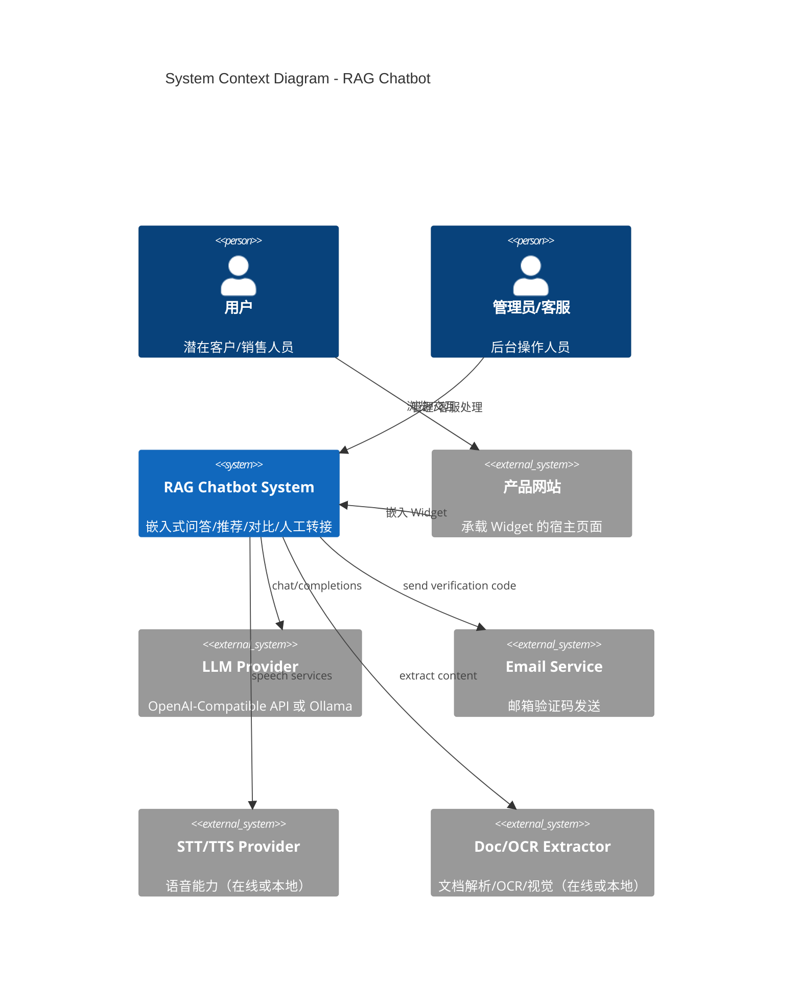
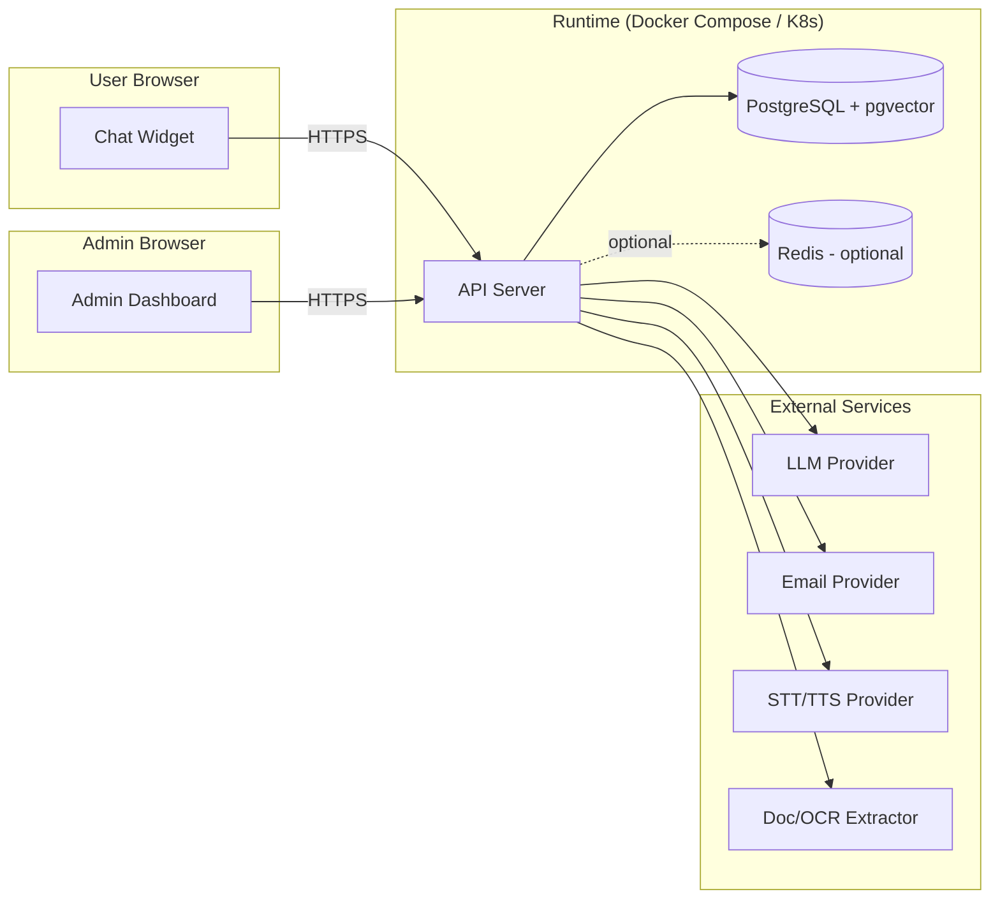

# System Architecture Overview

> 系统架构概览：组件边界、部署拓扑和信任边界。

## — BEGIN REGISTRY —

```architecture-registry
schema_version: "v0.6.5"
type: "overview"
parent: "docs/L2/interfaces.md"

items:
  - id: ARCH-OV-001
    statement: "系统采用三组件架构：嵌入式 Chat Widget + API Server + Admin Dashboard，并通过 REST API 解耦。"
    sources:
      - id: "IFC-CHAT-API"
        path: "docs/L2/interfaces.md#IFC-CHAT-API"
      - id: "IFC-ADMIN-API"
        path: "docs/L2/interfaces.md#IFC-ADMIN-API"
    rationale: "将用户交互、管理界面与后端能力解耦，便于独立部署与演进。"

  - id: ARCH-OV-002
    statement: "API Server 作为唯一后端入口，统一鉴权、限流与审计，并对外提供一致的错误语义与版本策略。"
    sources:
      - id: "REQ-L0-SEC-003"
        path: "docs/L0/requirements.md#REQ-L0-SEC-003"
      - id: "IFC-CHAT-API"
        path: "docs/L2/interfaces.md#IFC-CHAT-API"
    rationale: "降低安全与运维复杂度，避免多入口导致的安全规则分散。"

  - id: ARCH-OV-003
    statement: "核心业务数据与向量索引统一落在 PostgreSQL + pgvector，Redis 作为可选缓存层以满足性能指标。"
    sources:
      - id: "REQ-L2-API-009"
        path: "docs/L2/api-server/requirements.md#REQ-L2-API-009"
      - id: "REQ-L0-PERF-001"
        path: "docs/L0/requirements.md#REQ-L0-PERF-001"
    rationale: "满足 v0.1 技术边界并减少重复查询与 LLM 调用成本。"

  - id: ARCH-OV-004
    statement: "LLM 能力通过 Provider 抽象层实现，可在 OpenAI-Compatible API 与本地 Ollama 间切换。"
    sources:
      - id: "REQ-L2-API-004"
        path: "docs/L2/api-server/requirements.md#REQ-L2-API-004"
    rationale: "满足在线/本地两种模式需求，并为后续模型选择与成本控制留出空间。"

  - id: ARCH-OV-005
    statement: "对用户输入与引用内容执行基础安全处理（校验、转义、最小化敏感信息），并在 prompt 组装阶段加入注入防护策略。"
    sources:
      - id: "REQ-L0-SEC-004"
        path: "docs/L0/requirements.md#REQ-L0-SEC-004"
      - id: "REQ-L2-API-001"
        path: "docs/L2/api-server/requirements.md#REQ-L2-API-001"
    rationale: "降低 prompt injection 与引用污染风险，保证引用可追溯与可呈现。"

  - id: ARCH-OV-006
    statement: "文件/图片上传与解析采用异步或后台任务方式执行，前端可观察进度；解析失败不阻塞基础对话与检索。"
    sources:
      - id: "REQ-L2-API-012"
        path: "docs/L2/api-server/requirements.md#REQ-L2-API-012"
      - id: "REQ-L2-WGT-005"
        path: "docs/L2/chat-widget/requirements.md#REQ-L2-WGT-005"
    rationale: "解析与 OCR 可能耗时且依赖外部服务，异步化有利于稳定性与用户体验。"
```

## — END REGISTRY —

---

## 1. 系统上下文 (System Context)



---

## 2. 组件边界 (Component Boundaries)

| 组件 | 技术栈 | 代码路径（规划） | 职责 | 需求来源 |
|------|--------|------------------|------|----------|
| chat-widget | TypeScript/React | `apps/widget` | 嵌入式交互、登录/上传/语音、人机切换 | `REQ-L2-WGT-*` |
| api-server | Python/FastAPI | `apps/api` | RAG/推荐/对比、索引、认证、转接、管理 API | `REQ-L2-API-*` |
| admin-dashboard | TypeScript/React | `apps/admin` | 产品/知识库/索引/日志、客服工作台 | `REQ-L2-ADM-*` |

```
┌─────────────────────────────────────────────────────────────────┐
│                        Host Website (Public)                     │
│  ┌───────────────────┐                                          │
│  │   Chat Widget     │  REST                                     │
│  │  (apps/widget)    │ ───────────────────────────────────────┐  │
│  └───────────────────┘                                        │  │
└────────────────────────────────────────────────────────────────┘  │
                                                                      │
                                                                      ▼
                                                           ┌────────────────┐
                                                           │   API Server   │
                                                           │  (apps/api)    │
                                                           └───────┬────────┘
                                                                   │
                          ┌───────────────────────────────┬────────┴───────────┐
                          ▼                               ▼                    ▼
                 ┌────────────────┐             ┌────────────────┐    ┌────────────────────┐
                 │ PostgreSQL +   │             │ Redis (optional)│    │ External Providers │
                 │ pgvector       │             │ cache/rate      │    │ LLM/Email/STT/OCR  │
                 └────────────────┘             └────────────────┘    └────────────────────┘
```

---

## 3. 部署拓扑 (Deployment Topology)



---

## 4. 信任边界 (Trust Boundaries)

- Public Zone：宿主网站 + Widget（不可信输入源）。
- API Boundary：API Server 公开端点（统一限流、输入校验、安全策略）。
- Internal Zone：PostgreSQL/Redis（最小权限访问，网络隔离）。
- Admin Zone：Admin Dashboard（必须鉴权、审计）。

---

## 5. 与 Charter 技术边界的一致性

本架构仅使用 `charter.yaml#constraints.technology_boundary.allowed` 中允许的核心技术：
Python(FastAPI)、TypeScript(React)、PostgreSQL+pgvector、Redis（可选）、OpenAI-Compatible API / Ollama，以及可配置的 STT/TTS 与 OCR/解析能力。
